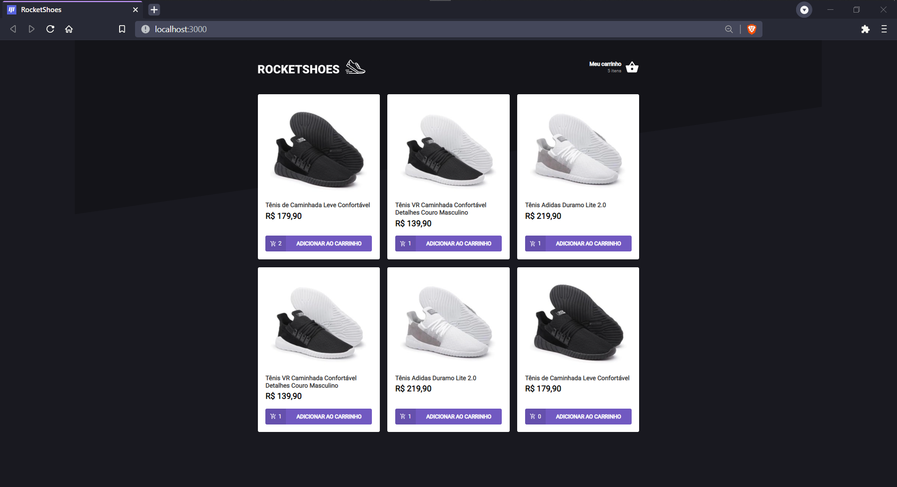

 

# Rocketshoes

## Sobre

Desafio 01 - Criando um hook de carrinho de compras

Essa será uma aplicação onde o seu principal objetivo é criar um hook de carrinho de compras.
Você terá acesso a duas páginas, um componente e um hook para implementar as funcionalidades pedidas nesse desafio:

- [x] Adicionar um novo produto ao carrinho;
- [x] Remover um produto do carrinho;
- [x] Alterar a quantidade de um produto no carrinho;
- [x] Cálculo dos preços sub-total e total do carrinho;
- [x] Validação de estoque;
- [x] Exibição de mensagens de erro;
- [x] Entre outros.

## Scripts

- Front-End - `yarn start`
- Back-End - `yarn server`
- Testes - `yarn test`

## Links

- [Desafio](https://www.notion.so/Desafio-01-Criando-um-hook-de-carrinho-de-compras-5769216778794019a83f544e79167b12)
- [Template](https://github.com/rocketseat-education/ignite-template-reactjs-criando-um-hook-de-carrinho-de-compras)

Com todo 💚 por [Ecthon](https://github.com/ecthon).
